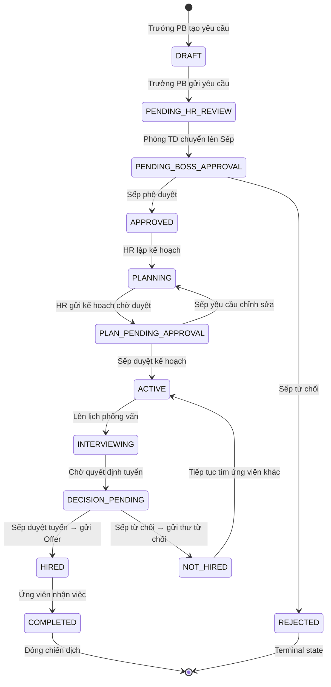

# 8. Recruitment Workflow Reference

## Workflow Diagram

```
[Trưởng Phòng Ban] --- (1. Gửi Yêu Cầu) ---> [Phòng Tuyển Dụng]
                                                    |
                                            (2. Trình Duyệt)
                                                    v
[Trưởng Phòng Ban] <--- (Từ chối) -------- [Admin / Boss]
                                                    |
                                             (3. Phê Duyệt)
                                                    v
[Phòng Tuyển Dụng] <--------------------------------+
     |
     +---> (4. Trưởng phòng NS Tạo Kế hoạch Tổng thể & Kế hoạch Triển khai)
     |
     +---> (5. Tìm kiếm UV & Ứng viên Upload CV → Hệ thống Vector Search)
     |
     +---> (6. Lên lịch phỏng vấn → Gửi Thư mời [Ứng viên] & [Trưởng Phòng/Boss])
     |
     +---> (7. Cập nhật Kết quả Phỏng vấn → [Boss] Review duyệt)
     |
     +---> (8. Gửi Thư kết quả: Offer Letter (Đạt) / Thư từ chối kèm lý do (Không đạt))
```

## State Machine: RecruitmentRequest



## Core Workflow Focus

### 1. Tính liên tục từ Nhân sự lên Giám đốc

Đảm bảo luồng thông tin không bị đứt gãy. Mọi quyết định của Giám đốc hoặc đề xuất từ Nhân sự đều được thông báo theo thời gian thực (Real-time Notification) đến các bên liên quan.

### 2. Lưu vết và Theo dõi (Tracking)

Hệ thống ghi lại toàn bộ lịch sử (Log):

- Ngày tạo yêu cầu
- Ngày duyệt
- Người đăng bài tuyển dụng
- Số lượng CV thu thập theo tuần
- Tiến độ phỏng vấn

Trưởng phòng ban có thể truy cập dashboard kiểm tra bất cứ lúc nào để biết vị trí của mình "ai đang làm và làm tới đâu".

### 3. Tổ chức theo kế hoạch

Hệ thống khóa chặt quy trình. Nhân viên tuyển dụng **không thể thực hiện các bước tiếp theo** nếu:

- Kế hoạch triển khai chưa được phê duyệt
- Thời gian chiến dịch nằm ngoài khung kế hoạch tổng thể

### 4. Lịch phỏng vấn thông minh

Tự động đối chiếu lịch rảnh của Trưởng phòng ban/Sếp để gợi ý khung giờ phỏng vấn phù hợp, hạn chế tối đa việc trùng lịch hoặc hoãn lịch.

## Data Flow Summary

```
1. Trưởng PB creates RecruitmentRequest (DRAFT)
   └─ Fills: position, headcount, JD, skill requirements, justification

2. Trưởng PB submits → PENDING_HR_REVIEW
   └─ Notification sent to Phòng Tuyển Dụng

3. Phòng TD reviews and forwards → PENDING_BOSS_APPROVAL
   └─ Notification sent to Admin/Boss

4. Admin/Boss approves → APPROVED
   └─ Notification sent to Phòng TD and Trưởng PB

5. Phòng TD creates Recruitment Plan
   └─ Overall plan: start/end dates
   └─ Detailed plan: task assignments (post job, collect CV, organize interview)
   └─ Plan submitted for Boss approval

6. Boss approves plan → ACTIVE campaign
   └─ HR team executes per the plan

7. Candidates upload CVs → Vector Search enabled
   └─ CV parsed → structured data + embeddings stored

8. HR schedules interviews → sends invitations
   └─ Smart scheduling checks interviewer availability
   └─ Interview invite sent to Candidate + Department Head/Boss

9. Interview results recorded
   └─ Boss reviews and decides: hire or reject

10. Result communication
    └─ PASS: Offer Letter + compensation package
    └─ FAIL: Polite rejection email with reasons
```

## Vector Search for CV Screening

```bash
# 1. Enable pgvector extension
psql -d recruitment_rms -c "CREATE EXTENSION IF NOT EXISTS vector;"

# 2. Add vector column to CV data
ALTER TABLE cv_embeddings ADD COLUMN embedding vector(384);

# 3. Create similarity search index
CREATE INDEX idx_cv_embeddings_vector
  ON cv_embeddings USING ivfflat (embedding vector_cosine_ops)
  WITH (lists = 100);

# 4. Install transformers.js in worker
cd services/worker && npm install @xenova/transformers
```

---

_Last updated: 2026-05-28_
