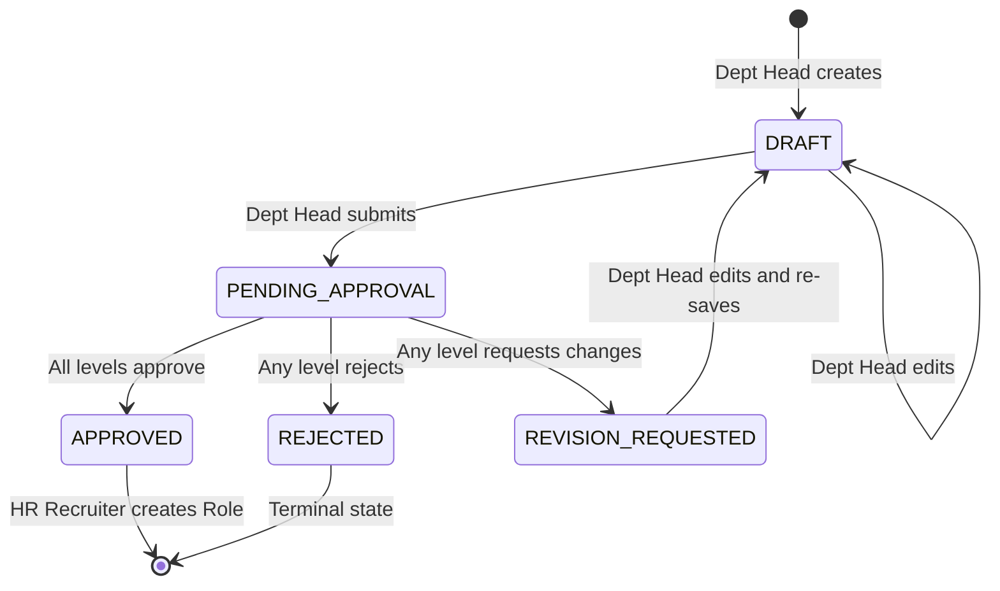

# Enterprise Hiring Workflow Design — Works Reruiter

**Created:** 2026-05-23
**Status:** SPECIFICATION
**Epic:** Epic 1 — Publish a Scoped Supported Job
**FRs covered:** FR1, FR2, FR3, FR24, FR27, FR28, FR29, FR30, FR31

---

## Workflow Overview

The Enterprise Hiring Workflow is a multi-step approval process that ensures all recruitment activities are properly authorized before resources are committed. It bridges the gap between organizational need and active recruitment.

```
┌──────────────┐     Submit     ┌──────────────────┐    Approve    ┌──────────────┐
│  DEPARTMENT   │──────────────→│  HIRING MANAGER  │─────────────→│ HR RECRUITER │
│    HEAD       │               │  (Approval Queue) │              │ (Role Setup) │
│               │  ←── Revise ──│                    │              │              │
│ Create Hiring │               │ Approve / Reject / │              │ Create Role  │
│   Request     │               │ Request Revision   │              │ Publish Job  │
└──────────────┘               └──────────────────┘              └──────────────┘
```

## State Machine: HiringRequest



### Valid Transitions

| From | To | Actor | Action |
|------|----|-------|--------|
| — | `DRAFT` | DEPT_HEAD | Create request |
| `DRAFT` | `DRAFT` | DEPT_HEAD | Edit request fields |
| `DRAFT` | `PENDING_APPROVAL` | DEPT_HEAD | Submit for approval |
| `PENDING_APPROVAL` | `APPROVED` | HM (last level) | Approve (all levels complete) |
| `PENDING_APPROVAL` | `REJECTED` | HM (any level) | Reject with reason |
| `PENDING_APPROVAL` | `REVISION_REQUESTED` | HM (any level) | Request revision with notes |
| `REVISION_REQUESTED` | `DRAFT` | DEPT_HEAD | Acknowledge and re-edit |

## Multi-Level Approval Algorithm

### How It Works

1. When a HiringRequest is submitted, the system looks up the `ApprovalChain` for the request's department (or org-wide default)
2. For each `ApprovalChainLevel` (ordered by `level` ASC), a `HiringRequestApproval` record is created with `decision = PENDING`
3. Only the **current level** approver sees the request in their queue
4. When level N approves, `currentLevel` increments and level N+1 is activated
5. If **all levels** approve, the request status transitions to `APPROVED`
6. If **any level** rejects, the entire request transitions to `REJECTED`
7. If **any level** requests revision, the request goes to `REVISION_REQUESTED`

### Pseudocode

```typescript
async submitForApproval(requestId: string, actorId: string) {
  const request = await findRequest(requestId);
  assert(request.status === 'DRAFT');
  assert(request.requestedById === actorId);

  const chain = await findApprovalChain(request.departmentId);
  assert(chain.levels.length > 0);

  // Create approval records for each level
  for (const level of chain.levels) {
    await createApproval({
      hiringRequestId: request.id,
      approverUserId: level.approverUserId,
      level: level.level,
      decision: 'PENDING',
    });
  }

  await updateRequest(request.id, {
    status: 'PENDING_APPROVAL',
    currentLevel: 1,
    submittedAt: new Date(),
  });
}

async processDecision(requestId: string, approverId: string, dto: ApproveRejectInput) {
  const request = await findRequest(requestId);
  assert(request.status === 'PENDING_APPROVAL');

  const approval = await findApproval(requestId, approverId, request.currentLevel);
  assert(approval.decision === 'PENDING');

  await updateApproval(approval.id, {
    decision: dto.decision,
    comments: dto.comments,
    decidedAt: new Date(),
  });

  if (dto.decision === 'APPROVED') {
    const nextLevel = request.currentLevel + 1;
    const hasMoreLevels = await existsApproval(requestId, nextLevel);

    if (hasMoreLevels) {
      await updateRequest(requestId, { currentLevel: nextLevel });
    } else {
      await updateRequest(requestId, {
        status: 'APPROVED',
        approvedAt: new Date(),
      });
    }
  } else if (dto.decision === 'REJECTED') {
    await updateRequest(requestId, {
      status: 'REJECTED',
      rejectionReason: dto.comments,
      rejectedAt: new Date(),
    });
  } else if (dto.decision === 'REVISION_REQUESTED') {
    await updateRequest(requestId, {
      status: 'REVISION_REQUESTED',
      revisionNotes: dto.comments,
    });
  }
}
```

## Data Flow: Request → Role → Job

```
1. Dept Head creates HiringRequest (DRAFT)
   └─ Fills: title, description, justification, headcount, priority, workMode, location, budget

2. Dept Head submits → PENDING_APPROVAL
   └─ System creates HiringRequestApproval records per chain level

3. Hiring Manager(s) approve in sequence
   └─ Level 1 approves → Level 2 activates → ... → APPROVED

4. HR Recruiter creates Role from approved request
   └─ Role.hiringRequestId = request.id
   └─ Pre-populates: title, description, workMode, location from request

5. HR Recruiter opens JD Wizard
   └─ Pastes/uploads JD text → Document created (type=JD, linked to Role)
   └─ Worker parses JD → JobCapabilityModel created

6. HR Recruiter reviews & edits capabilities
   └─ Edits hard constraints, preferred vs required skills

7. HR Recruiter publishes Role
   └─ Role.isActive = true
   └─ Job appears in Candidate marketplace
```

## Screen Mapping

| UX Screen | Stitch ID | User Role | Purpose |
|-----------|-----------|-----------|---------|
| DH Dashboard | `dh-dashboard` | DEPT_HEAD | Overview + quick actions |
| Hiring Request Flow | `dh-hiring-request` | DEPT_HEAD | Create/edit/submit requests |
| HM Dashboard | `hm-dashboard` | HIRING_MANAGER | Overview + approval queue |
| Approval Dashboard | `hm-approval-dashboard` | HIRING_MANAGER | Review/approve/reject requests |
| HR Dashboard | `hr-dashboard` | HR_RECRUITER | Overview + pipeline stats |
| JD Wizard | `hr-jd-wizard` | HR_RECRUITER | Create role from approved request |

## Notifications (Future)

| Event | Recipient | Channel |
|-------|-----------|---------|
| Request submitted | Next-level approver | In-app + email |
| Request approved (final) | Dept Head + HR Recruiter | In-app + email |
| Request rejected | Dept Head | In-app + email |
| Revision requested | Dept Head | In-app + email |
| Role published | Dept Head | In-app |
